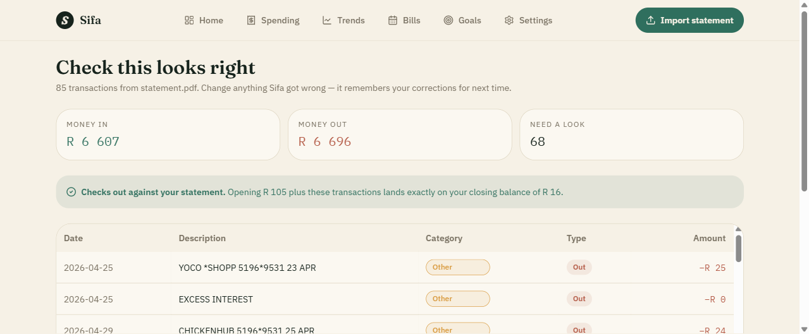

# Sifa

**A South African personal finance app.** Drop in a bank statement; it reads it,
sorts every transaction, and tells you what actually happened to your money.

No manual data entry. No spreadsheet. Nothing uploaded.

### ▶ [Try it live: sifa-beryl.vercel.app](https://sifa-beryl.vercel.app)

No sign-up, no bank connection. Bring a CSV or PDF statement, or click
*"Or add a transaction by hand"* to look around with no file at all.

[](https://github.com/StanLeyM07/SIFA/actions/workflows/ci.yml)




*The review step after importing a real 85-transaction Capitec statement. The
green bar is a reconciliation check: opening balance plus every parsed
transaction must land exactly on the statement's closing balance, or the parse
is wrong and the user is told so.*

---

## For reviewers: the three things worth looking at

If you are assessing this repo rather than using the app, these are the parts
that carry the actual engineering:

| What | Where | Why it is interesting |
|---|---|---|
| **The AI cannot state a wrong number** | [`app/src/backend/src/routes/coach.ts`](app/src/backend/src/routes/coach.ts) | Every figure the model emits is extracted and checked against a pre-computed fact sheet. Invented numbers fail the request. Written after the model claimed a R11 001 overspend in a month that ended R7 101 in credit |
| **Statement parsing and reconciliation** | [`app/src/frontend/src/lib/sifa/import/`](app/src/frontend/src/lib/sifa/import/) | Real bank PDFs are inconsistent. The parser is checked by a balance reconciliation rather than trusted |
| **A categoriser that learns** | [`app/src/frontend/src/lib/sifa/categorize/`](app/src/frontend/src/lib/sifa/categorize/) | User corrections persist and compound, so the work drops toward zero on repeat imports |

Seven dependency-free smoke suites cover all three. `npm test` in either package.

---

## How someone actually uses it

1. Download a statement from their banking app (CSV preferred, PDF works)
2. Drag it onto the import screen
3. Sifa parses and categorises it **in the browser**, then shows a review table
4. They fix anything wrong — Sifa remembers those corrections permanently
5. The dashboard tells them what stands out

Step 4 is the compounding bit. People shop at the same twenty places, so after
a couple of imports the categoriser is effectively tuned to that person and
corrections stop being necessary.

## Structure

```
app/src/frontend/   TanStack Start + React 19 + Tailwind v4   (port 5174)
app/src/backend/    Express — one endpoint, the AI coach       (port 3001)
```

The backend does one job: turn a sheet of pre-computed figures into a
paragraph of prose. Everything else — parsing, categorising, every metric —
runs client-side.

### Commands

```bash
# frontend
cd app/src/frontend
npm install && npm run dev      # http://localhost:5174
npm run build                   # production build
npx tsc --noEmit                # typecheck

# backend
cd app/src/backend
npm install && npm run dev      # http://localhost:3001
npm run typecheck
```

### Tests

Seven dependency-free smoke suites. No test framework, no mocking library, no
config: each file asserts and exits non-zero on failure, which is enough at this
size and keeps the dependency tree honest.

```bash
cd app/src/frontend && npm test    # 6 suites
cd app/src/backend  && npm test    # 1 suite
```

Both run in CI on every push and pull request.

| Suite | Covers |
|---|---|
| `import/parse.smoke.ts` | date and amount parsing, CSV shapes |
| `import/import-selection.smoke.ts` | duplicate detection, import-count correctness |
| `categorize/smoke.ts` | merchant matching, correction learning |
| `coach/facts.smoke.ts` | metric correctness, privacy assertions |
| `insights.smoke.ts` | deterministic insight rules |
| `period-stats.smoke.ts` | period aggregation, divide-by-zero on no income |
| `backend/routes/coach.smoke.ts` | the anti-hallucination guard |

## The two things that make this trustworthy

### Statements never leave the device

`pdfjs-dist` and PapaParse run in the browser. The file is never uploaded, so
account numbers, addresses and balances physically cannot reach a server.
This is a real claim the UI makes, and it has to stay true — don't add a
server-side upload path.

### The AI cannot state a wrong number

Financial advice built on a hallucinated figure is worse than none. Two
defences, both necessary — during development the model produced *"You're
overspending by R11 001"* for a month with R7 101 **left over**:

1. **The verdict is pre-computed.** `facts.ts` decides surplus vs deficit and
   passes it in. The model is never asked to work that out.
2. **Every number is verified.** `coach.ts` extracts each figure from the
   response and checks it against the fact sheet. Invented figures fail the
   request, and the dashboard falls back to deterministic insights that are
   correct by construction.

The model also only ever receives **aggregates** — never transactions, merchant
names or dates. That keeps the promise above intact and makes the prompt a few
hundred tokens instead of a few thousand.

## Deploying

### Frontend — Vercel (static)

The app runs in SPA mode. No user data exists server-side, and rendering is
gated on client hydration, so a server render could only ever emit the loading
shell — SPA mode ships that shell as static HTML instead. No serverless
function, no cold start.

In the Vercel dashboard:

- **Root Directory:** `app/src/frontend`
- **Framework Preset:** Other (`vercel.json` supplies build + output)
- **Environment variable:** `VITE_API_URL` → your API URL

`vercel.json` handles the rest: output from `dist/client`, SPA rewrites to
`_shell.html`, immutable caching for hashed assets and no-cache for `sw.js`.

### Backend — Render

Either connect the repo and let `render.yaml` configure the service, or set it
up manually:

- **Root Directory:** `app/src/backend`
- **Build:** `npm ci && npm run build && npm prune --omit=dev`
- **Start:** `npm start` (runs compiled `dist/index.js`)
- **Health check:** `/api/health`

Set these in the dashboard, never in the repo:

- `FRONTEND_ORIGIN` — your Vercel URL, exactly. **Never a wildcard.**
- `LLM_API_KEY`
- (`LLM_BASE_URL`, `LLM_MODEL`, `LLM_DAILY_CALL_LIMIT` come from `render.yaml`)

Deploy the backend first so you have its URL for `VITE_API_URL`. If the API is
down or absent the app still works — the dashboard falls back to deterministic
insights.

**Render's free tier sleeps after ~15 minutes idle**, so the first coach
request after a quiet spell can take 30–60s. The UI degrades gracefully, but
it's the reason `app/src/backend/Dockerfile` exists: when that becomes
annoying, the same image runs on Fly.io, Railway or any VPS unchanged. Vercel
cannot host it — it takes static output and functions, not containers.

### Before going live

- [ ] `FRONTEND_ORIGIN` set to the real domain
- [ ] Billing alerts on the LLM provider
- [ ] Privacy policy + POPIA notice (financial data, even client-side)
- [ ] Analytics (Plausible/Umami) — the point of a free launch is learning
      whether people return; without it you learn nothing


